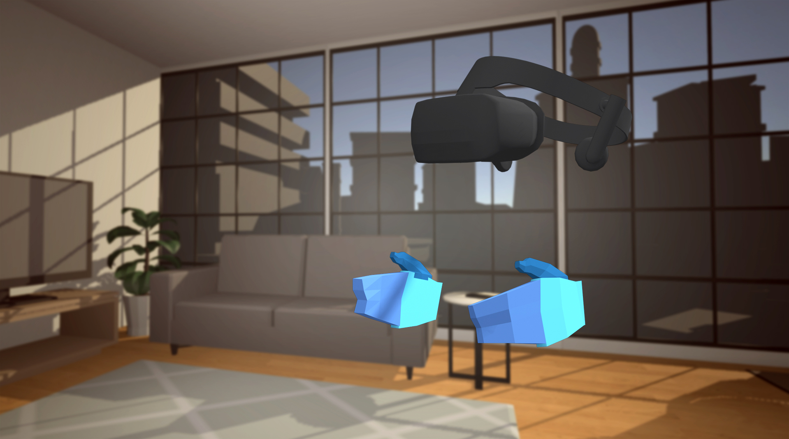
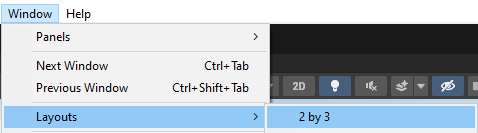
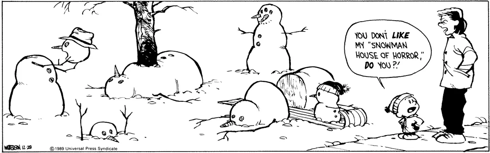

# VR_Class

 Students will learn the basics of game development and Virtual Reality by creating a game! This course will cover topics such as game engines, 3D space, art assets, and an introduction to coding. We will bring it all together to create a game in virtual reality. No programming experience is necessary but participants need a general familiarity with computers and using software.
 

---
# Table Of Content
[VR Safety](#vr-safety)
- [Creating A Safe Stationary Boundry](#creating-a-safe-stationary-boundry)
- [Coiling Cords](#coiling-cords)

[Cirriculum](#Cirriculum)
- [Lesson 1: Overview](#lesson-1--overview)

  + [Intro To Unity](#intro-to-unity)
   - [Unity Layout](#unity-layout)
   - [Position, Rotation, Scale](#position--rotation--scale)
   - [Build a Snowman](#build-a-snowman)
 * [Lesson 2: Living Room 1: Build a Living Room](#lesson-2--living-room-1--build-a-living-room)
 * [Lesson 3: Living Room 2: Import Assets Into The Living Room](#lesson-3--living-room-2--import-assets-into-the-living-room)
 * [Lesson 5: Coding](#lesson-5--coding)
 * [Lesson 6: Block Slicer 1: Import A Song](#lesson-6--block-slicer-1--import-a-song)
 * [Lesson 7: Block Slicer 2: Import Assets](#lesson-7--block-slicer-2--import-assets)
 * [Lesson 8: Block Slicer Finale: Shocase](#lesson-8--block-slicer-finale--shocase)
---

# VR Safety

https://www.youtube.com/watch?v=Ke4MefpmRmc&ab_channel=MetaQuest

If any student feels dizzy
- Take off the headset
- Take a seat
- Grab a water and or snack

Teacher notes
- Ensure snacks and water are readily available
- Keep an eye out for off balance students
- Know where the nursing program is in case medical attention is required

#### Creating A Safe Stationary Boundry

No Room Scale boundaries are allowed in this class.

https://youtu.be/zh5ldprM5Mg?si=aGCoaAT2xltc8pwq

*Excercise: Practice setting up a new boundary*

Have the students:
- Disconnect the Link Cable from the headset
- Put on the wrist straps and headset 'welder style' resting on their forehead
- Walk across the room, outside their previously set up boundary
- Set up a stationary boundary
- Walk back to their original station,
- Ensure each student is at least arms reach away from
- - Their desk
- - Other students. This may require stagering their chair positons for safe distance
- Set up another stationary boundary near their station

Purpose: Help the students get comfortable with this process of setting up a safe boundary

## Coiling Cords

A simple circle coil with enough space on either end to reach the computer and headset, velcroing the circle closed. This is covered in the first 30 seconds of this video:
https://youtu.be/PeLrxXUbq0g?si=doWgMNpqIP_2NphR

---
# Cirriculum

## Lesson 1: Overview
VR Safety, Intro To Unity (Position, Rotation Scale), Build A Snowman

### Intro To Unity

Have the students open the NUAC_VR_Class Project in Unity. The layout used in this class is 2 by 3.

#### Unity Layout

https://learn.unity.com/tutorial/explore-the-unity-editor-1#6273f00fedbc2a7f158cc1ee

#### Position, Rotation, Scale

https://docs.unity3d.com/Manual/class-Transform.html

#### Build a Snowman

Using position, rotation, and scale, make 3 spheres on top of each other. The smallest on top, the largest on the bottom.
>  [!TIP] 
> Extra Challenges:
> - Add a Hat
> - Add a face
> - Add color: https://youtube.com/shorts/mJ2y-eNDTxY?si=_dYi70ktqydniQac
> - Build a winter landscape around the snowman with trees, hills, and snow (small spheres)
> - Build a snowman cinematic moment

---

## Lesson 2: Living Room 1: Build a Living Room
Using Unity's Create With VR project, we are going to design a living room.

Starting with Assets/Scenes/Create-with-VR-Startr-Scene.unity, have the student open the scene and save it with their name:

example: LivingRoom_JohnDoe.unity

You can use the following lesson plan segments from Create With VR:
1.2 - Explore the StarterScene
1.3 - Add a room and backaground

https://learn.unity.com/tutorial/vr-project-setup?uv=2022.3&courseId=60183276edbc2a2e6c4c7dae&projectId=60183335edbc2a2e6c4c7dcb#65c511fbedbc2a263ed98726

Once the room is in, hide the floor plane by disabling its renderer so it does not clip into the room floor.

Have the students furnish the living room with prefabs in Assets/_Course Library/_Prefabs

>  [!TIP]
> Extra Challenge:
> - **Make A Dollhouse:** Add a second room into the scene, shrink the scale so it fits on a table, furnish it with scaled down furniture

---
## Lesson 3: Living Room 2: Import Assets Into The Living Room
Student's continue to build our their living rooms. They now download assets form the Unity Asset Store* and import them into the project.

https://youtu.be/m0IanoBHJuc

>  [!TIP]
> Extra Challenge:
> - Build an art gallery section of the living room with assets from the Asset Store 

---
## Lesson 4: Particles
Students will learn to build a fire with a simple particles system

### Part 1: Fire 

https://youtu.be/2R2fBelebuY

- 00:00 - Intro
- 01:00 - Building A Fire
- 01:39 - General Settings
- 02:20 - Shape
- 02:50 - Size Over Lifetime
- 04:10 - Renderer
- 04:49 - Color Over Lifetime
- 05:40 - Jammo Fire Head

>  [!TIP] Particle Settings To Make A Fire
> - General
>   - Color: Orange
>   - Start Speed: 1
>   - Start Lifetime: 2
> - Shape
>   - Angle: 0
>   - Radius: 0.5
> - Size Over Lifetime: Large -> Small
> - Renderer
>   - Material: Default Particle System
> - Color Over Lifetime: Orange -> Red

### Part 2: Explosion, Electrical Storm

https://youtu.be/SuhvMkOQ_LY

- 00:00 - Intro
- 00:30 - Setup
- 01:00 - Explosion General Settings
- 02:00 - Explosion Emission
- 02:45 - Explosion Shape
- 03:15 - Explosion Color Over Lifetime
- 03:50 - Electrical Storm Setup
- 04:55 - Electrical Storm General Settings
- 05:10 - Electrical Storm Color Over Lifetime
- 06:27 - Electrical Storm Shape
- 06:27 - Electrical Storm Size Over Lifetime
- 07:25 - Review
- 07:40 - Jammo Electric Storm Hand

> [!TIP] Particle Settings To Make An Explosion
> - General
>   - Duration: 1
>  - Start Speed: 3
>  - Start Lifetime: 1
>  - Looping: Unchecked
>  - Max Particles: 1000
> - Shape
>  - Shape: Sphere
>   - Radius: 0.1
> - Color Over Lifetime: Yellow -> Red

> [!TIP] Particle Settings To Make An Electrical Storm
> - Transform: Rotation: 90, 0, 0
> - General
>   - Duration: 1
>   - Start Rotation: 90
> - Renderer
>  - Material: cfxr line loop electric ab.mat
> - Shape
>   - Shape: Cone
>   - Angle: 25
>   - Radius: 0.1
> - Color Over Lifetime: White -> Blue
> - Size Over Lifetime: Small -> Large

> [!TIP]
> Extra Challenges:
> - **Campfire Scene**: Create a complete campfire with logs, rocks in a circle, and smoke particles rising above the flames
> - **Multi-colored Fire**: Experiment with different color gradients (blue flames, green magical fire, purple mystical flames)
> - **Electrical Aura**: Add a continuous electrical field around an object or character
> - **Weather System**: Create a thunderstorm scene with rain particles, lightning, and occasional fire strikes

---
## Lesson 5: Teleportation
Students will learn how to move around their VR Living Rooms

https://learn.unity.com/course/create-with-vr/unit/vr-basics/tutorial/vr-locomotion?version=2021.3

>  [!TIP]
> **Hidden Objects:** Place objects in the room that can only be found through 
> **Neighbors:** Make a second room, access it through a series of steps you can telport around

--

## Lesson 6: Grabbable Objects
Students will learn how to Grab and throw objects in their rooms

https://learn.unity.com/course/create-with-vr/unit/vr-basics/tutorial/1-3-grabbable-gameobjects?version=2021.3

>  [!TIP]
> **Stacking Blocks:** Have a table with various sized blocks, make it challenging to stack them
> 
> **Jordan!:** Place a basket on one end of the room and have a pille of balls the user can grab, try to throw the balls into the basket

---
## Lesson 7: Coding
Students will review two scripts and write their own. The result is a button that makes an explosion. Please review this video prio to the class:

https://www.youtube.com/watch?v=5WWv2AALDEw

The code can be found in Readme_files folder
- ExplodeScript.pdf: meant to be printed prior to class. One per student
- OnTriggerExplode.txt: meant to be copied and pasted for the teacher.

---

## Lesson 8: Block Slicer 1: Import A Song
Students will be introduced to Block Slicer project. They can choose a song on youtube, convert it to mp3, and import it into the project.

Block Slicer Overview, Script Description, Import A Song, Level Design:
https://youtu.be/sKdPo2XSR9I

- 00:00 - [Intro](https://youtu.be/sKdPo2XSR9I)
- 01:55 - [Scripts](https://youtu.be/sKdPo2XSR9I?si=CFMIHne-fsHUS8__&t=115)
- - 02:53 - [Block Script](https://youtu.be/sKdPo2XSR9I?si=Hrj734gIdXkxY2u6&t=173)
- - 04:34 - [ScoreKeeper Script](https://youtu.be/sKdPo2XSR9I?si=vnmkUKXaZ0OYu2Ak&t=274)
- - 06:26 - [GameLogic Script](https://youtu.be/sKdPo2XSR9I?si=6rqWMY_y0DfRzXLi&t=386)
- **10:07 - [Import A Song](https://youtu.be/sKdPo2XSR9I?si=TB1xn3uOtAoAVY0y&t=607)** <- I have been asked to highlight this section to save time when students ask questions
- 13:01 - [Level Design](https://youtu.be/sKdPo2XSR9I?si=JN4IJYQP6tD7ooIQ&t=781)

Once they have their songe, they then use the level design section of the video to fill out their level design.

---

## Lesson 9: Block Slicer 2: Import Assets
Students continue the Block Slicer project, adding assets into the game to fit their theme.

https://youtu.be/q5ejxITvEh8?si=KGsG8_Xfnx2bWijT

>  [!TIP]
> Extra Challenges:
> - Add animated assets from the asset Store
> - Add particles from

## Lesson 10: Block Slicer 3: Make Sabers, Blocks,and Explosions Your Own
Students continue the Block Slicer project; customizing the sabers, blocks, and explosions their own

---

## Lesson 11: Block Slicer Finale: Showcase
The first half of the project is wrapping up the game. The second half is testing and providing feedback to each other's games.

I suggest providing each station with a notepad and pencil for constructive feedback.

Often students have asked 'What now?'. To help answer this question, I created this doc: https://docs.google.com/document/d/1-Zr1-BWbv38F5prGsQcs3Cpi0dr8enqO48IX3qsXLcw/edit?usp=sharing

I encourage the teacher to review this document with the class then copy the content to an email and send it to any student tht is interested.

*Any and all contant that is imported into our projects will be 'class appropriate / PG'. If a student is unsure if content is fits that category, teacher is encouraged to make a judgement call.

 
